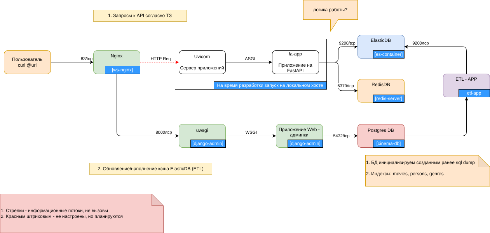

# 🎬 Архитектура и структура проекта (Заметки)

## 🐳 Инфраструктура и ETL (Docker Compose)

Сборка и запуск инфраструктурных сервисов осуществляется через Docker Compose..
Все сервисы взаимодействуют между собой через единую Docker-сеть: **`network-etl`** (тип: `bridge`).

### Сервисы:
*   **`cinema-db`** (`tcp/5432`) — База данных PostgreSQL. При старте выполняется инициализационный скрипт, который заливает необходимую структуру и тестовые данные для дальнейшей работы (взято из предыдущего ш
*   **`es-container`** (`tcp/9200`) — Elasticsearch. Индекс создается автоматически при запуске ETL-приложения.
*   **`etl-app`** — Периодически запускаемый скрипт (ETL-пайплайн), который следит за изменениями в PostgreSQL и выполняет загрузку/обновление данных в Elasticsearch.

### Запуск и удаление:

1. Подготовительные работы:

1.1 Переименовать **etl/env_example в etl/.env**

1.2 Переименовать **admin/env_example в admin/.env**


2. Запуск и сборка: **docker-compose up --build**


если хотим все снести: **docker-compose down -v**


---

## ⚡ FastAPI Приложение (`fa-app`)

Основное API-приложение, предоставляющее данные клиентам.

### 🚀 Запуск и настройка
На данном этапе приложение запускается вручную в режиме разработки.

1. **Подготовка окружения:**
   ```bash
   python -m venv venv
   source venv/bin/activate  # Для Windows: venv\Scripts\activate
   pip install -r fa-app/requirements.txt```

2. **Запуск сервера:**
    ```fastapi dev fa-app/main.py```

3. **Проверка приложения Fast-API app:**

```curl http://127.0.0.1:8000/api/v1/films/ac58403b-7070-4dcc-8e53-fa2d2d2284ab```

и в браузере ```http://localhost:8000/api/openapi```

## ⚡ Проверка админки

В браузере ткнуться по url: http://localhost:83/admin

login/pass: super/puper

##Схемка для понимания:



##Структура проекта:
```
/
├── etl/                  # Логика ETL-приложения (кроме скрипта инициализации БД)
├── admin/                # админка django
├── init_db/              # Скрипты инициализации БД (структура и начальные данные)
├── fa-app/               # 📦 FastAPI приложение
│   ├── core/             # Базовые настройки и конфигурация
│   │   ├── config.py     # Настройки окружения, хосты, порты, переменные
│   │   └── logger.py     # Конфигурация логирования
│   ├── api/              # HTTP-интерфейс (роутеры и эндпоинты)
│   ├── db/               # Подключения к БД и провайдеры зависимостей
│   ├── models/           # Бизнес-сущности (схемы данных)
│   ├── services/         # Бизнес-логика приложения
│   ├── tests/            # Тесты (пока лежат примеры curl-запросов)
│   └── main.py           # Точка входа (инициализация FastAPI)
└── docs/                 # Схемы архитектуры и техническая документация
```
